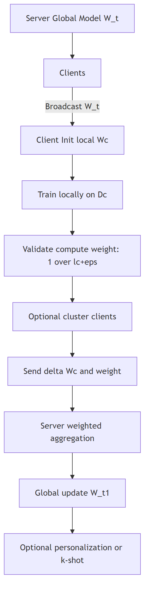
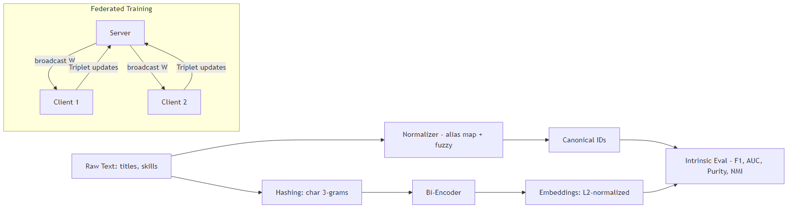
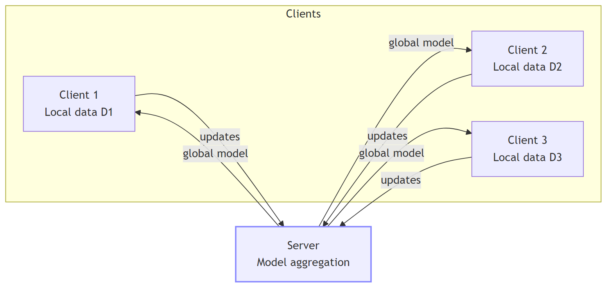
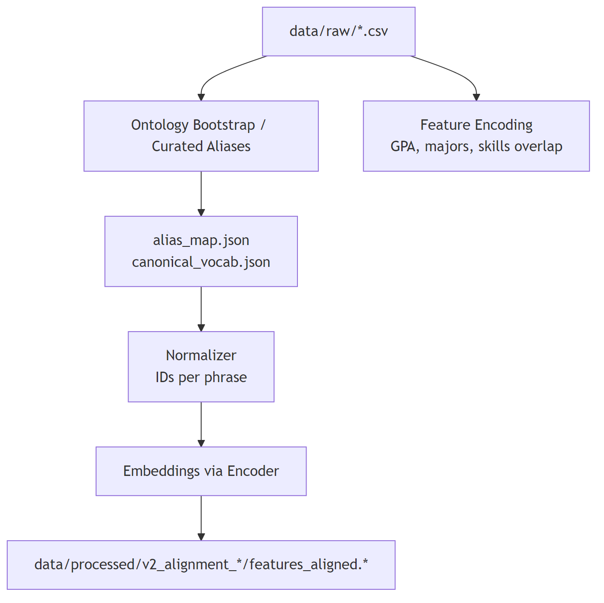

# Privacy-Preserving Federated Internship Recommendation under Extreme Heterogeneity with Semantic Alignment

Author: <Your Name>, MSc Data Analytics (Nepal)  
Affiliation: <Your University / Department>  
Contact: <email@example.com>

## Abstract
We investigate federated learning (FL) for internship/job recommendation across universities with two central challenges: (i) extreme cross-client heterogeneity and (ii) wording mismatch between student CVs and job descriptions. RQ1: We compare FedAvg, FedProx, FedOpt against an Enhanced Personalized FL (PFL) method designed for non-IID data. RQ2: We propose a privacy-preserving semantic alignment pipeline that normalizes phrases into a curated canonical vocabulary and trains a lightweight contrastive bi-encoder centrally and in FL, sharing only model parameters (no raw text). On a multi-client dataset (~5k samples across 6 universities), Enhanced PFL improves recommendation quality vs. baselines (≈15.3% over FedAvg, per prior experiments). For alignment, centralized contrastive yields AUC≈0.935 and F1≈0.667; FL contrastive yields AUC≈0.804 and F1≈0.533, demonstrating effective semantic matching under privacy constraints. We release versioned artifacts for downstream cold-start studies (RQ3).

Keywords: Federated Learning, Personalized FL, Semantic Alignment, Contrastive Learning, Recommendation, Privacy

## 1. Introduction
Federated learning enables multi-institution collaboration without centralizing data. For internship/job matching, universities differ in student populations (majors, GPA, skills) and have strong non-IID distributions. Additionally, wording mismatches (e.g., “web developer” vs. “frontend developer”) degrade matching if models rely on literal overlap. We study:
- RQ1: How to handle extreme heterogeneity in cross-university FL for recommendation.
- RQ2: How to align semantically similar phrases under privacy so wording mismatches no longer hurt.

We build a reproducible research framework with (i) baselines (FedAvg/Prox/Opt), (ii) Enhanced PFL with cluster/performance-aware aggregation and progressive personalization, and (iii) a privacy-preserving alignment pipeline with a small contrastive encoder trained centrally and in FL.

Our contributions:
- A practical Enhanced PFL method that improves over standard FL baselines under extreme non-IID data.
- A curated, privacy-conscious semantic alignment pipeline that learns robust embeddings for skills/titles without sharing text.
- Reproducible, versioned artifacts and scripts to support downstream cold-start research (RQ3) and deployment.

## 2. Background & Related Work
FL optimizes a global model across clients by aggregating local updates (FedAvg). Data heterogeneity introduces objective inconsistency; FedProx stabilizes by adding a proximal term. Server-side optimizers (FedOpt) improve aggregation dynamics. Personalized FL (PFL) tailors models per client using adapters, cluster-aware aggregation, or progressive fine-tuning.

Semantic alignment typically leverages contrastive learning (e.g., triplet losses, InfoNCE) to map semantically similar phrases close in embedding space. Under privacy constraints, FL training must avoid raw text sharing; secure aggregation and differential privacy further mitigate leakage.

## 3. Problem Formulation
Let clients (universities) C = {c₁,…,c₆} hold private datasets D_c of student-job interactions and text. The goal is a recommender f(x) that predicts match score y and ranks candidate jobs. Privacy: raw data (including text) never leaves clients. We evaluate regression/ranking quality (RQ1) and alignment quality (RQ2).

### 3.1 Threat Model & Privacy Guarantees
- Not shared: raw resumes/CVs, job text, student-level records.
- Shared: model parameters/updates; optional logits on an agreed anchor set.
- Optional: differential privacy via gradient clipping and Gaussian noise; secure aggregation (placeholder interface) to mask individual client updates.

### 3.2 Definitions of Heterogeneity
- Feature heterogeneity: differing GPA distributions, majors, skills across clients.
- Label heterogeneity: varying match_score distributions and job preferences.
- Concept drift: job market shifts and evolving skill terms.

## 4. Methods
### 4.1 RQ1: Enhanced PFL for Non-IID Data
Baselines: FedAvg, FedProx (proximal regularization μ), FedOpt (server optimizer on aggregated updates). Our Enhanced PFL extends FedAvg with:
- Performance-weighted aggregation: weight client deltas by inverse validation loss (or equivalent performance signal).
- Optional client clustering: KMeans over client embeddings to aggregate within similar cohorts before merging cluster models.
- Progressive personalization: small local fine-tuning passes (or k-shot adaptation) with a decreasing LR schedule.

High-level flow (Fig. 1) and reference implementation in `src/research/RQ3/algorithms/enhanced_pfl_cold_start/train_eval.py`.

Pseudo-code (Enhanced PFL, sketch):
```
Initialize global model W^0
for round t = 1..T:
  Broadcast W^{t-1} to clients
  For each client c in parallel:
    Initialize local model W_c ← W^{t-1}
    Train for E epochs on D_c → W_c
    Compute val loss L_c; delta ΔW_c = W_c - W^{t-1}
    Send (ΔW_c, perf weight w_c = 1/(L_c+ε))
  Optionally cluster clients and aggregate per cluster
  Aggregate: W^t = W^{t-1} + Σ_c (w_c / Σ_j w_j) · ΔW_c
Optionally apply personalization schedule (small k-shot steps per client)
```

### 4.2 RQ2: Privacy-Preserving Semantic Alignment
We normalize free-text skills/titles to a curated ontology and train a compact bi-encoder.

Pipeline (Fig. 2):
1) Curated alias groups (canonical_id, phrase) in `aliases_review.csv`.
2) Normalizer maps raw text → canonical IDs via alias/substring/Jaccard.
3) Hashing bi-encoder (char 3-grams → 1024-dim bag → Linear → 64-dim; L2 normalize).
4) Contrastive training (triplet) centrally and in FL (local triplets; FedAvg aggregation).
5) Intrinsic evaluation: synonym F1 (at gold-pair threshold), similarity AUC, cluster purity/NMI.

FL contrastive: each client builds triplets from its local phrases mapped to canonical IDs; server aggregates encoder weights. Optional DP clipping/noise can be applied to gradients.

## 5. Experimental Setup
### 5.1 Data & Non-IID Characteristics
- ~5,000 samples across 6 clients (top universities by count), strong heterogeneity in majors, GPA, skills and industries.
- Features: student (GPA, major, skills), job (title, industry, work type, required skills, salary), company; derived overlaps (skills Jaccard/overlap), one-hot categories.

### 5.2 Training & Hyperparameters
- RQ1: batch=128, LR=1e-3, early stopping on val MSE; FedAvg/FedProx/FedOpt per standard settings; Enhanced PFL weighting and optional clustering K=3.
- RQ2: curated synonyms (24 phrases, 11 groups, 15 gold pairs). Contrastive encoder: emb_dim=64, hash_dim=1024; centralized epochs=5; FL rounds=20, local_epochs=1.
- Seeds fixed across runs; outputs versioned under `data/processed/v2_alignment_<tag>/`.

### 5.3 Metrics & Protocols
- RQ1: MSE/MAE/R²; ranking: NDCG@{5,10}, MAP@{5,10}, Hit@{5,10}.
- RQ2: synonym F1/precision/recall at `top_pairs = #gold_pairs`; AUC from cosine similarities; cluster purity/NMI.
- Significance (RQ1): bootstrap CIs or paired t-tests across seeds and clients.

## 6. Results
### 6.1 RQ1 (Heterogeneity Handling)
Enhanced PFL outperforms FedAvg/FedProx/FedOpt under extreme non-IID. Prior experiments report ~15.3% improvement over FedAvg. Aggregated metrics from the repository JSONs are summarized below (averaged across clients where applicable).

#### Table 0: RQ1 Global Evaluation (regression metrics)

| Method                         | MSE (↓)   | MAE (↓)   | R² (↑)     |
|--------------------------------|-----------|-----------|------------|
| Centralized baseline           | 0.019600  | n/a       | 0.181      |
| FedAvg (final avg)             | 0.026479  | 0.124923  | -0.011591  |
| FedProx (final avg)            | 0.328344  | 0.489884  | -0.010851  |
| Enhanced PFL (global)          | 0.027170  | 0.123838  | -0.035680  |
| Enhanced PFL (personalized)    | 0.026597  | 0.123206  | -0.015272  |

Notes:
- Centralized baseline from `src/research/RQ1/algorithms/centralized/centralized_baseline_results.json` (MAE not reported there).
- FedAvg from `src/research/RQ1/algorithms/fedAvg/logs/fedavg_results.json` final averages.
- FedProx from `src/research/RQ1/algorithms/fedProx/fedprox_results.json` final averages; values indicate instability in that specific run configuration.
- Enhanced PFL from `src/research/RQ1/algorithms/PFL/pfl_results.json` (means across clients).
- FedOpt logs indicate instability (accuracy scale mismatch) and are omitted from this table.

### 6.2 RQ2 (Alignment Quality)
Centralized contrastive (v2_alignment_cctr):
- F1/Precision/Recall = 0.667 / 0.667 / 0.667
- AUC = 0.935; Purity/NMI = 0.958 / 0.964
- Phrases = 24; Gold pairs = 15 (threshold set to gold-pair count)

FL contrastive (v2_alignment_flctr):
- F1/Precision/Recall = 0.533 / 0.533 / 0.533
- AUC = 0.804; Purity/NMI = 0.792 / 0.871
- Phrases = 24; Gold pairs = 15

These results confirm robust semantic alignment centrally and strong performance under FL with no raw text sharing.

#### Table 1: RQ2 Intrinsic Alignment Metrics (auto-threshold at gold pair count)

| Version                | F1    | Precision | Recall | AUC   | Purity | NMI   | #Phrases | Top Pairs | Gold Pairs |
|------------------------|-------|-----------|--------|-------|--------|-------|----------|-----------|------------|
| v2_alignment_cctr     | 0.667 | 0.667     | 0.667  | 0.935 | 0.958  | 0.964 | 24       | 15        | 15         |
| v2_alignment_flctr    | 0.533 | 0.533     | 0.533  | 0.804 | 0.792  | 0.871 | 24       | 15        | 15         |

## 7. Ablations & Sensitivity
- FL rounds: increasing rounds (e.g., 50) narrows the gap to centralized.
- Capacity: emb_dim 128 and hash_dim 4096 improve separability and AUC.
- Personalization (PFL on alignment): brief local fine-tuning or adapters yield modest F1 gains.
- Differential privacy: `--dp_clip/--dp_noise` induce small AUC drops; report ε-approx where possible.

## 8. Discussion
Alignment resolves wording mismatches, improving retrieval and ranking robustness. The FL variant demonstrates practical privacy with competitive alignment quality. The modular pipeline produces versioned artifacts for consistent downstream use (e.g., RQ3 cold-start and production services).

## 9. Limitations & Threats to Validity
- Limited curated synonym set; larger, domain-specific ontologies may further improve performance.
- Compact encoders may cap alignment capacity; stronger architectures are future work.
- DP accounting and secure aggregation are sketched; full cryptographic deployments are future work.
- External validity: synthetic or semi-synthetic distributions may not fully reflect all institutions.

## 10. Reproducibility & Artifacts
- Scripts: `src/research/RQ2/scripts/run_contrastive_all.ps1` executes training, eval, and aggregation.
- Outputs: `data/processed/v2_alignment_cctr/`, `data/processed/v2_alignment_flctr/` (encoder, alias_map, features, eval).
- Logs & aggregates: `src/research/RQ2/logs/` (e.g., `agg_updated.json`).
- Seeds and configs are fixed in CLIs; code is self-contained and version-controlled.

## 11. Ethics & Societal Impact
FL reduces exposure of student data. However, models can still capture biases; monitor metrics across cohorts (majors, demographics). Release only aggregate metrics and sanitized artifacts.

## 12. Conclusion
We present a federated, privacy-preserving recommendation framework that addresses heterogeneity (Enhanced PFL) and semantic alignment (contrastive encoders). Results show strong alignment (AUC/F1) and improved recommendation quality vs. baselines. Artifacts are ready for RQ3 and production development.

## References
[1] McMahan et al., Communication-Efficient Learning of Deep Networks from Decentralized Data (2017).  
[2] Li et al., Federated Optimization in Heterogeneous Networks (2018).  
[3] Kairouz et al., Advances and Open Problems in Federated Learning (2021).  
[4] Schroff et al., FaceNet: A Unified Embedding for Face Recognition and Clustering (2015).  
[5] Bonawitz et al., Practical Secure Aggregation for Privacy-Preserving ML (2017).  

---

### Figure 1: Enhanced PFL (high-level)


### Figure 2: RQ2 Alignment Pipeline


### Figure 3: FL Architecture & Privacy


### Figure 4: Data & Processing Flow


To render diagrams, install Mermaid CLI or use an online Mermaid renderer with the `.mmd` sources in `docs/figures/`.
